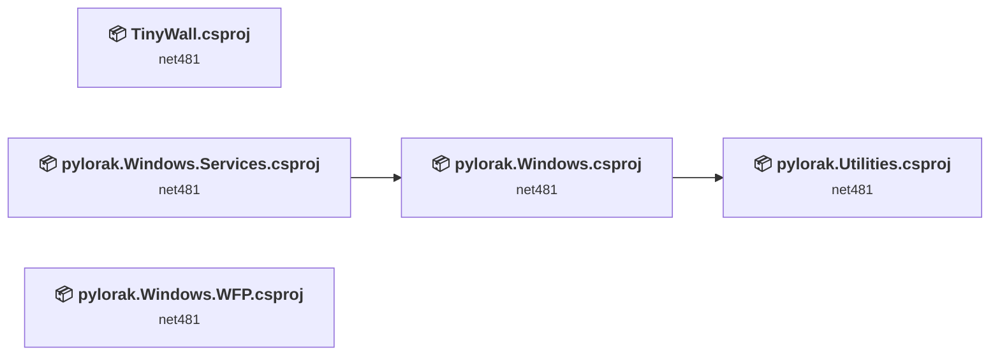
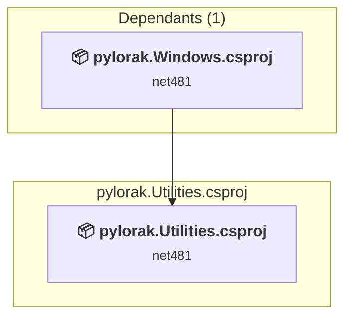
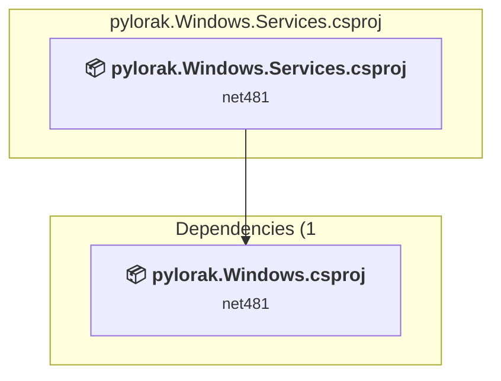
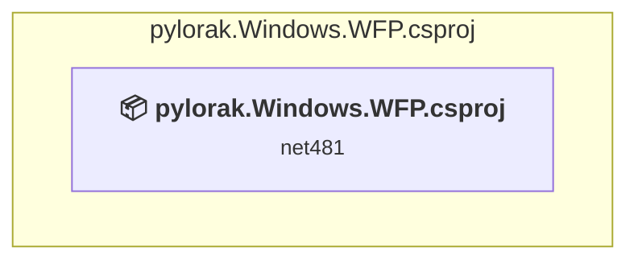
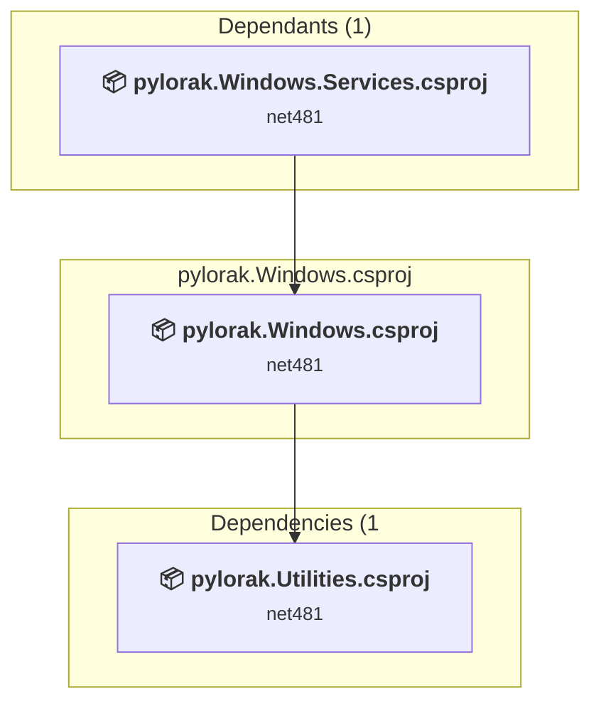
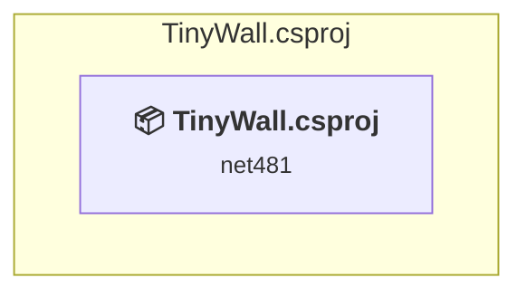

# Projects and dependencies analysis

This document provides a comprehensive overview of the projects and their dependencies in the context of upgrading to .NETCoreApp,Version=v10.0.

## Table of Contents

- [Executive Summary](#executive-Summary)
  - [Highlevel Metrics](#highlevel-metrics)
  - [Projects Compatibility](#projects-compatibility)
  - [Package Compatibility](#package-compatibility)
  - [API Compatibility](#api-compatibility)
- [Aggregate NuGet packages details](#aggregate-nuget-packages-details)
- [Top API Migration Challenges](#top-api-migration-challenges)
  - [Technologies and Features](#technologies-and-features)
  - [Most Frequent API Issues](#most-frequent-api-issues)
- [Projects Relationship Graph](#projects-relationship-graph)
- [Project Details](#project-details)

  - [pylorak.Utilities\pylorak.Utilities.csproj](#pylorakutilitiespylorakutilitiescsproj)
  - [pylorak.Windows.Services\pylorak.Windows.Services.csproj](#pylorakwindowsservicespylorakwindowsservicescsproj)
  - [pylorak.Windows.WFP\pylorak.Windows.WFP.csproj](#pylorakwindowswfppylorakwindowswfpcsproj)
  - [pylorak.Windows\pylorak.Windows.csproj](#pylorakwindowspylorakwindowscsproj)
  - [TinyWall\TinyWall.csproj](#tinywalltinywallcsproj)

## Executive Summary

### Highlevel Metrics

| Metric | Count | Status |
| :--- | :---: | :--- |
| Total Projects | 6 | All require upgrade |
| Total NuGet Packages | 11 | 4 need upgrade |
| Total Code Files | 253 |  |
| Total Code Files with Incidents | 83 |  |
| Total Lines of Code | 52348 |  |
| Total Number of Issues | 8012 |  |
| Estimated LOC to modify | 7999+ | at least 15.3% of codebase |

### Projects Compatibility

| Project | Target Framework | Difficulty | Package Issues | API Issues | Est. LOC Impact | Description |
| :--- | :---: | :---: | :---: | :---: | :---: | :--- |
| [pylorak.Utilities\pylorak.Utilities.csproj](#pylorakutilitiespylorakutilitiescsproj) | net481 | 🟢 Low | 1 | 4 | 4+ | ClassLibrary, Sdk Style = True |
| [pylorak.Windows.Services\pylorak.Windows.Services.csproj](#pylorakwindowsservicespylorakwindowsservicescsproj) | net481 | 🟢 Low | 0 | 11 | 11+ | ClassLibrary, Sdk Style = True |
| [pylorak.Windows.WFP\pylorak.Windows.WFP.csproj](#pylorakwindowswfppylorakwindowswfpcsproj) | net481 | 🟢 Low | 0 | 32 | 32+ | ClassLibrary, Sdk Style = True |
| [pylorak.Windows\pylorak.Windows.csproj](#pylorakwindowspylorakwindowscsproj) | net481 | 🟡 Medium | 1 | 133 | 133+ | WinForms, Sdk Style = True |
| [TinyWall\TinyWall.csproj](#tinywalltinywallcsproj) | net481 | 🟡 Medium | 6 | 7819 | 7819+ | WinForms, Sdk Style = True |

### Package Compatibility

| Status | Count | Percentage |
| :--- | :---: | :---: |
| ✅ Compatible | 7 | 63.6% |
| ⚠️ Incompatible | 0 | 0.0% |
| 🔄 Upgrade Recommended | 4 | 36.4% |
| ***Total NuGet Packages*** | ***11*** | ***100%*** |

### API Compatibility

| Category | Count | Impact |
| :--- | :---: | :--- |
| 🔴 Binary Incompatible | 7200 | High - Require code changes |
| 🟡 Source Incompatible | 780 | Medium - Needs re-compilation and potential conflicting API error fixing |
| 🔵 Behavioral change | 19 | Low - Behavioral changes that may require testing at runtime |
| ✅ Compatible | 41233 |  |
| ***Total APIs Analyzed*** | ***49232*** |  |

## Aggregate NuGet packages details

| Package | Current Version | Suggested Version | Projects | Description |
| :--- | :---: | :---: | :--- | :--- |
| Microsoft.Extensions.DependencyInjection | 9.0.6 | 10.0.8 | [TinyWall.csproj](#tinywalltinywallcsproj) | NuGet package upgrade is recommended |
| Microsoft.Extensions.DependencyInjection.Abstractions | 9.0.6 | 10.0.8 | [TinyWall.csproj](#tinywalltinywallcsproj) | NuGet package upgrade is recommended |
| Microsoft.Extensions.Options | 9.0.6 | 10.0.8 | [TinyWall.csproj](#tinywalltinywallcsproj) | NuGet package upgrade is recommended |
| Microsoft.Windows.SDK.Contracts | 10.0.26100.4188 |  | [TinyWall.csproj](#tinywalltinywallcsproj) | ✅Compatible |
| NeoSmart.AsyncLock | 3.2.1 |  | [TinyWall.csproj](#tinywalltinywallcsproj) | ✅Compatible |
| NeoSmart.Synchronization | 2.0.0 |  | [TinyWall.csproj](#tinywalltinywallcsproj) | ✅Compatible |
| Nullable | 1.3.1 |  | [pylorak.Utilities.csproj](#pylorakutilitiespylorakutilitiescsproj) [pylorak.Windows.csproj](#pylorakwindowspylorakwindowscsproj) [pylorak.Windows.WFP.csproj](#pylorakwindowswfppylorakwindowswfpcsproj) [TinyWall.csproj](#tinywalltinywallcsproj) | ✅Compatible |
| System.Memory | 4.6.3 |  | [pylorak.Utilities.csproj](#pylorakutilitiespylorakutilitiescsproj) [pylorak.Windows.csproj](#pylorakwindowspylorakwindowscsproj) | NuGet package functionality is included with framework reference |
| System.Net.Http | 4.3.4 |  | [TinyWall.csproj](#tinywalltinywallcsproj) | NuGet package functionality is included with framework reference |
| System.Text.Json | 9.0.6 | 10.0.8 | [TinyWall.csproj](#tinywalltinywallcsproj) | NuGet package upgrade is recommended |
| System.Text.RegularExpressions | 4.3.1 |  | [TinyWall.csproj](#tinywalltinywallcsproj) | NuGet package functionality is included with framework reference |

## Top API Migration Challenges

### Technologies and Features

| Technology | Issues | Percentage | Migration Path |
| :--- | :---: | :---: | :--- |
| Windows Forms | 7102 | 88.8% | Windows Forms APIs for building Windows desktop applications with traditional Forms-based UI that are available in .NET on Windows. Enable Windows Desktop support: Option 1 (Recommended): Target net9.0-windows; Option 2: Add <UseWindowsDesktop>true</UseWindowsDesktop>; Option 3 (Legacy): Use Microsoft.NET.Sdk.WindowsDesktop SDK. |
| GDI+ / System.Drawing | 549 | 6.9% | System.Drawing APIs for 2D graphics, imaging, and printing that are available via NuGet package System.Drawing.Common. Note: Not recommended for server scenarios due to Windows dependencies; consider cross-platform alternatives like SkiaSharp or ImageSharp for new code. |
| Legacy Configuration System | 29 | 0.4% | Legacy XML-based configuration system (app.config/web.config) that has been replaced by a more flexible configuration model in .NET Core. The old system was rigid and XML-based. Migrate to Microsoft.Extensions.Configuration with JSON/environment variables; use System.Configuration.ConfigurationManager NuGet package as interim bridge if needed. |
| Configuration Installation Components | 29 | 0.4% | System.Configuration installer components for deploying applications with custom installation logic that are not available for .NET Core. The installer infrastructure has been removed. Use modern deployment tools like Windows Installer XML (WiX), InstallShield, or platform-specific package managers. |
| System Management (WMI) | 17 | 0.2% | Windows Management Instrumentation (WMI) APIs for system administration and monitoring that are available via NuGet package System.Management. These APIs provide access to Windows system information but are Windows-only; consider cross-platform alternatives for new code. |
| Code Access Security (CAS) | 16 | 0.2% | Code Access Security (CAS) APIs that were removed in .NET Core/.NET for security and performance reasons. CAS provided fine-grained security policies but proved complex and ineffective. Remove CAS usage; not supported in modern .NET. |
| Legacy Cryptography | 9 | 0.1% | Obsolete or insecure cryptographic algorithms that have been deprecated for security reasons. These algorithms are no longer considered secure by modern standards. Migrate to modern cryptographic APIs using secure algorithms. |
| Windows Forms Legacy Controls | 2 | 0.0% | Legacy Windows Forms controls that have been removed from .NET Core/5+ including StatusBar, DataGrid, ContextMenu, MainMenu, MenuItem, and ToolBar. These controls were replaced by more modern alternatives. Use ToolStrip, MenuStrip, ContextMenuStrip, and DataGridView instead. |
| Windows Access Control Lists (ACLs) | 1 | 0.0% | Windows Access Control List (ACL) APIs for file, directory, and synchronization object security that have moved to extension methods or different types. While .NET Core supports Windows ACLs, the APIs have been reorganized. Use System.IO.FileSystem.AccessControl and similar packages for ACL functionality. |

### Most Frequent API Issues

| API | Count | Percentage | Category |
| :--- | :---: | :---: | :--- |
| T:System.Windows.Forms.Button | 648 | 8.1% | Binary Incompatible |
| T:System.Windows.Forms.Label | 343 | 4.3% | Binary Incompatible |
| T:System.Windows.Forms.TextBox | 293 | 3.7% | Binary Incompatible |
| T:System.Drawing.Bitmap | 260 | 3.3% | Source Incompatible |
| T:System.Windows.Forms.ToolStripMenuItem | 223 | 2.8% | Binary Incompatible |
| T:System.Windows.Forms.ListView | 213 | 2.7% | Binary Incompatible |
| T:System.Windows.Forms.DialogResult | 203 | 2.5% | Binary Incompatible |
| P:System.Windows.Forms.Control.Name | 197 | 2.5% | Binary Incompatible |
| T:System.Windows.Forms.TabPage | 188 | 2.4% | Binary Incompatible |
| T:System.Windows.Forms.Control.ControlCollection | 173 | 2.2% | Binary Incompatible |
| P:System.Windows.Forms.Control.Controls | 173 | 2.2% | Binary Incompatible |
| M:System.Windows.Forms.Control.ControlCollection.Add(System.Windows.Forms.Control) | 173 | 2.2% | Binary Incompatible |
| T:System.Windows.Forms.CheckBox | 160 | 2.0% | Binary Incompatible |
| T:System.Windows.Forms.ColumnHeader | 146 | 1.8% | Binary Incompatible |
| T:System.Drawing.Icon | 127 | 1.6% | Source Incompatible |
| T:System.Windows.Forms.Keys | 113 | 1.4% | Binary Incompatible |
| T:System.Drawing.Image | 95 | 1.2% | Source Incompatible |
| T:System.Windows.Forms.ImageList | 93 | 1.2% | Binary Incompatible |
| P:System.Windows.Forms.TextBox.Text | 91 | 1.1% | Binary Incompatible |
| P:System.Windows.Forms.ButtonBase.UseVisualStyleBackColor | 80 | 1.0% | Binary Incompatible |
| T:System.Windows.Forms.RadioButton | 66 | 0.8% | Binary Incompatible |
| T:System.Windows.Forms.Panel | 62 | 0.8% | Binary Incompatible |
| E:System.Windows.Forms.Control.Click | 62 | 0.8% | Binary Incompatible |
| M:System.Windows.Forms.Button.#ctor | 61 | 0.8% | Binary Incompatible |
| P:System.Windows.Forms.ButtonBase.Image | 60 | 0.8% | Binary Incompatible |
| P:System.Windows.Forms.Control.Size | 52 | 0.7% | Binary Incompatible |
| T:System.Runtime.ConstrainedExecution.ReliabilityContractAttribute | 50 | 0.6% | Source Incompatible |
| T:System.Windows.Forms.ComboBox | 49 | 0.6% | Binary Incompatible |
| P:System.Windows.Forms.Control.Location | 49 | 0.6% | Binary Incompatible |
| P:System.Windows.Forms.Control.Enabled | 47 | 0.6% | Binary Incompatible |
| T:System.Windows.Forms.MessageBoxIcon | 46 | 0.6% | Binary Incompatible |
| T:System.Windows.Forms.MessageBoxButtons | 46 | 0.6% | Binary Incompatible |
| P:System.Windows.Forms.Control.TabIndex | 46 | 0.6% | Binary Incompatible |
| T:System.Windows.Forms.OpenFileDialog | 44 | 0.6% | Binary Incompatible |
| T:System.Windows.Forms.FormWindowState | 44 | 0.6% | Binary Incompatible |
| M:System.Windows.Forms.Label.#ctor | 43 | 0.5% | Binary Incompatible |
| P:System.Windows.Forms.CheckBox.Checked | 42 | 0.5% | Binary Incompatible |
| T:System.Windows.Forms.ToolTipIcon | 39 | 0.5% | Binary Incompatible |
| T:System.Windows.Forms.ListViewItem.ListViewSubItem | 37 | 0.5% | Binary Incompatible |
| T:System.Windows.Forms.ListViewItem.ListViewSubItemCollection | 37 | 0.5% | Binary Incompatible |
| P:System.Windows.Forms.ListViewItem.SubItems | 37 | 0.5% | Binary Incompatible |
| T:System.Windows.Forms.TableLayoutPanel | 37 | 0.5% | Binary Incompatible |
| T:System.Windows.Forms.ImageList.ImageCollection | 35 | 0.4% | Binary Incompatible |
| P:System.Windows.Forms.ImageList.Images | 35 | 0.4% | Binary Incompatible |
| T:System.Windows.Forms.GroupBox | 34 | 0.4% | Binary Incompatible |
| T:System.Windows.Forms.ListViewItem | 33 | 0.4% | Binary Incompatible |
| P:System.Windows.Forms.ColumnHeader.Tag | 33 | 0.4% | Binary Incompatible |
| T:System.Windows.Forms.TabControl | 32 | 0.4% | Binary Incompatible |
| M:System.Windows.Forms.Control.ResumeLayout(System.Boolean) | 31 | 0.4% | Binary Incompatible |
| M:System.Windows.Forms.Control.SuspendLayout | 31 | 0.4% | Binary Incompatible |

## Projects Relationship Graph

Legend:
📦 SDK-style project
⚙️ Classic project

## Project Details

### pylorak.Utilities\pylorak.Utilities.csproj

#### Project Info

- **Current Target Framework:** net481
- **Proposed Target Framework:** net10.0
- **SDK-style**: True
- **Project Kind:** ClassLibrary
- **Dependencies**: 0
- **Dependants**: 1
- **Number of Files**: 26
- **Number of Files with Incidents**: 2
- **Lines of Code**: 2279
- **Estimated LOC to modify**: 4+ (at least 0.2% of the project)

#### Dependency Graph

Legend:
📦 SDK-style project
⚙️ Classic project

### API Compatibility

| Category | Count | Impact |
| :--- | :---: | :--- |
| 🔴 Binary Incompatible | 0 | High - Require code changes |
| 🟡 Source Incompatible | 4 | Medium - Needs re-compilation and potential conflicting API error fixing |
| 🔵 Behavioral change | 0 | Low - Behavioral changes that may require testing at runtime |
| ✅ Compatible | 1365 |  |
| ***Total APIs Analyzed*** | ***1369*** |  |

#### Project Technologies and Features

| Technology | Issues | Percentage | Migration Path |
| :--- | :---: | :---: | :--- |
| Legacy Cryptography | 2 | 50.0% | Obsolete or insecure cryptographic algorithms that have been deprecated for security reasons. These algorithms are no longer considered secure by modern standards. Migrate to modern cryptographic APIs using secure algorithms. |

### pylorak.Windows.Services\pylorak.Windows.Services.csproj

#### Project Info

- **Current Target Framework:** net481
- **Proposed Target Framework:** net10.0
- **SDK-style**: True
- **Project Kind:** ClassLibrary
- **Dependencies**: 1
- **Dependants**: 0
- **Number of Files**: 7
- **Number of Files with Incidents**: 3
- **Lines of Code**: 1498
- **Estimated LOC to modify**: 11+ (at least 0.7% of the project)

#### Dependency Graph

Legend:
📦 SDK-style project
⚙️ Classic project

### API Compatibility

| Category | Count | Impact |
| :--- | :---: | :--- |
| 🔴 Binary Incompatible | 0 | High - Require code changes |
| 🟡 Source Incompatible | 11 | Medium - Needs re-compilation and potential conflicting API error fixing |
| 🔵 Behavioral change | 0 | Low - Behavioral changes that may require testing at runtime |
| ✅ Compatible | 882 |  |
| ***Total APIs Analyzed*** | ***893*** |  |

#### Project Technologies and Features

| Technology | Issues | Percentage | Migration Path |
| :--- | :---: | :---: | :--- |
| Code Access Security (CAS) | 7 | 63.6% | Code Access Security (CAS) APIs that were removed in .NET Core/.NET for security and performance reasons. CAS provided fine-grained security policies but proved complex and ineffective. Remove CAS usage; not supported in modern .NET. |

### pylorak.Windows.WFP\pylorak.Windows.WFP.csproj

#### Project Info

- **Current Target Framework:** net481
- **Proposed Target Framework:** net10.0
- **SDK-style**: True
- **Project Kind:** ClassLibrary
- **Dependencies**: 0
- **Dependants**: 0
- **Number of Files**: 31
- **Number of Files with Incidents**: 8
- **Lines of Code**: 6693
- **Estimated LOC to modify**: 32+ (at least 0.5% of the project)

#### Dependency Graph

Legend:
📦 SDK-style project
⚙️ Classic project

### API Compatibility

| Category | Count | Impact |
| :--- | :---: | :--- |
| 🔴 Binary Incompatible | 0 | High - Require code changes |
| 🟡 Source Incompatible | 30 | Medium - Needs re-compilation and potential conflicting API error fixing |
| 🔵 Behavioral change | 2 | Low - Behavioral changes that may require testing at runtime |
| ✅ Compatible | 3180 |  |
| ***Total APIs Analyzed*** | ***3212*** |  |

#### Project Technologies and Features

| Technology | Issues | Percentage | Migration Path |
| :--- | :---: | :---: | :--- |
| Legacy Cryptography | 1 | 3.1% | Obsolete or insecure cryptographic algorithms that have been deprecated for security reasons. These algorithms are no longer considered secure by modern standards. Migrate to modern cryptographic APIs using secure algorithms. |

### pylorak.Windows\pylorak.Windows.csproj

#### Project Info

- **Current Target Framework:** net481
- **Proposed Target Framework:** net10.0-windows
- **SDK-style**: True
- **Project Kind:** WinForms
- **Dependencies**: 1
- **Dependants**: 1
- **Number of Files**: 40
- **Number of Files with Incidents**: 11
- **Lines of Code**: 7859
- **Estimated LOC to modify**: 133+ (at least 1.7% of the project)

#### Dependency Graph

Legend:
📦 SDK-style project
⚙️ Classic project

### API Compatibility

| Category | Count | Impact |
| :--- | :---: | :--- |
| 🔴 Binary Incompatible | 74 | High - Require code changes |
| 🟡 Source Incompatible | 53 | Medium - Needs re-compilation and potential conflicting API error fixing |
| 🔵 Behavioral change | 6 | Low - Behavioral changes that may require testing at runtime |
| ✅ Compatible | 3720 |  |
| ***Total APIs Analyzed*** | ***3853*** |  |

#### Project Technologies and Features

| Technology | Issues | Percentage | Migration Path |
| :--- | :---: | :---: | :--- |
| Code Access Security (CAS) | 1 | 0.8% | Code Access Security (CAS) APIs that were removed in .NET Core/.NET for security and performance reasons. CAS provided fine-grained security policies but proved complex and ineffective. Remove CAS usage; not supported in modern .NET. |
| Windows Forms | 74 | 55.6% | Windows Forms APIs for building Windows desktop applications with traditional Forms-based UI that are available in .NET on Windows. Enable Windows Desktop support: Option 1 (Recommended): Target net9.0-windows; Option 2: Add <UseWindowsDesktop>true</UseWindowsDesktop>; Option 3 (Legacy): Use Microsoft.NET.Sdk.WindowsDesktop SDK. |
| GDI+ / System.Drawing | 33 | 24.8% | System.Drawing APIs for 2D graphics, imaging, and printing that are available via NuGet package System.Drawing.Common. Note: Not recommended for server scenarios due to Windows dependencies; consider cross-platform alternatives like SkiaSharp or ImageSharp for new code. |

### TinyWall\TinyWall.csproj

#### Project Info

- **Current Target Framework:** net481
- **Proposed Target Framework:** net10.0-windows
- **SDK-style**: True
- **Project Kind:** WinForms
- **Dependencies**: 0
- **Dependants**: 0
- **Number of Files**: 332
- **Number of Files with Incidents**: 59
- **Lines of Code**: 34019
- **Estimated LOC to modify**: 7819+ (at least 23.0% of the project)

#### Dependency Graph

Legend:
📦 SDK-style project
⚙️ Classic project

### API Compatibility

| Category | Count | Impact |
| :--- | :---: | :--- |
| 🔴 Binary Incompatible | 7126 | High - Require code changes |
| 🟡 Source Incompatible | 682 | Medium - Needs re-compilation and potential conflicting API error fixing |
| 🔵 Behavioral change | 11 | Low - Behavioral changes that may require testing at runtime |
| ✅ Compatible | 32086 |  |
| ***Total APIs Analyzed*** | ***39905*** |  |

#### Project Technologies and Features

| Technology | Issues | Percentage | Migration Path |
| :--- | :---: | :---: | :--- |
| System Management (WMI) | 17 | 0.2% | Windows Management Instrumentation (WMI) APIs for system administration and monitoring that are available via NuGet package System.Management. These APIs provide access to Windows system information but are Windows-only; consider cross-platform alternatives for new code. |
| Windows Access Control Lists (ACLs) | 1 | 0.0% | Windows Access Control List (ACL) APIs for file, directory, and synchronization object security that have moved to extension methods or different types. While .NET Core supports Windows ACLs, the APIs have been reorganized. Use System.IO.FileSystem.AccessControl and similar packages for ACL functionality. |
| Legacy Configuration System | 29 | 0.4% | Legacy XML-based configuration system (app.config/web.config) that has been replaced by a more flexible configuration model in .NET Core. The old system was rigid and XML-based. Migrate to Microsoft.Extensions.Configuration with JSON/environment variables; use System.Configuration.ConfigurationManager NuGet package as interim bridge if needed. |
| Configuration Installation Components | 29 | 0.4% | System.Configuration installer components for deploying applications with custom installation logic that are not available for .NET Core. The installer infrastructure has been removed. Use modern deployment tools like Windows Installer XML (WiX), InstallShield, or platform-specific package managers. |
| Windows Forms Legacy Controls | 2 | 0.0% | Legacy Windows Forms controls that have been removed from .NET Core/5+ including StatusBar, DataGrid, ContextMenu, MainMenu, MenuItem, and ToolBar. These controls were replaced by more modern alternatives. Use ToolStrip, MenuStrip, ContextMenuStrip, and DataGridView instead. |
| Code Access Security (CAS) | 8 | 0.1% | Code Access Security (CAS) APIs that were removed in .NET Core/.NET for security and performance reasons. CAS provided fine-grained security policies but proved complex and ineffective. Remove CAS usage; not supported in modern .NET. |
| Windows Forms | 7028 | 89.9% | Windows Forms APIs for building Windows desktop applications with traditional Forms-based UI that are available in .NET on Windows. Enable Windows Desktop support: Option 1 (Recommended): Target net9.0-windows; Option 2: Add <UseWindowsDesktop>true</UseWindowsDesktop>; Option 3 (Legacy): Use Microsoft.NET.Sdk.WindowsDesktop SDK. |
| GDI+ / System.Drawing | 516 | 6.6% | System.Drawing APIs for 2D graphics, imaging, and printing that are available via NuGet package System.Drawing.Common. Note: Not recommended for server scenarios due to Windows dependencies; consider cross-platform alternatives like SkiaSharp or ImageSharp for new code. |
| Legacy Cryptography | 6 | 0.1% | Obsolete or insecure cryptographic algorithms that have been deprecated for security reasons. These algorithms are no longer considered secure by modern standards. Migrate to modern cryptographic APIs using secure algorithms. |

